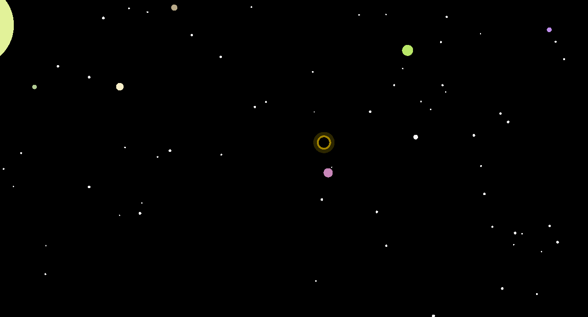

# SLMP — Simple Local Music Player

A small, fast music player for Linux (built on and for the Steam Deck) where
**folders are playlists**. Point it at a folder and it plays what's inside: no
library to scan, no tags to manage, no database. It also ships with a set of
audio-reactive screensavers you can run full screen, in a window, or as a tiny
live visualizer right in the player bar.

| Bars | Raindrops |
|---|---|
|  |  |
| **Space**
| 

## Features

- **Folders are playlists.** Playback stays inside the folder you started it in.
- Shuffle (plays every track once before repeating) and repeat: all / one / off.
- **Compact mode** (⇲): a small, Winamp-style window with symbol buttons and
  the mini visualizer. Switch back to the full player any time.
- **Mini visualizer** in the player bar; click it to pick a screensaver or open
  it in a window or full screen.
- **Seven screensavers:** Bars, Raindrops, Chaos, Journey, Space, Hungry and
  Black Holes, most of them reacting to the music.
- **Settings panel** (⚙) for everything, applied live. All settings live in a
  plain text `slmp.conf` you can also edit by hand.
- Remembers your last folder, volume, shuffle, repeat and window mode.

## Keyboard shortcuts

| Key | Action |
|---|---|
| `Space` | Play / pause |
| `N` / `P` | Next / previous track |
| `S` | Toggle shuffle |
| `R` | Cycle repeat (all → one → off) |
| `.` / `,` | Volume up / down |

In a screensaver window the same keys work, plus `F` toggles full screen. Any
other key or a click closes the screensaver.

## Download and run

Grab `SLMP-<version>-x86_64.AppImage` from the [Releases page](https://github.com/catastrophic-impact/slmp/releases), make it
executable and run it:

```sh
chmod +x SLMP-*-x86_64.AppImage
./SLMP-*-x86_64.AppImage
```

On first launch SLMP writes `slmp.conf` **next to the AppImage**. Running AppImages needs
`libfuse2`, which SteamOS and most desktop distros already have.

## Building from source

SLMP is an Electron app. Only Linux x86_64 AppImage builds are supported.

### Requirements

- **Node.js 22** and npm
- The usual Electron runtime libraries. On Ubuntu/Debian:
  `libnss3 libgtk-3-0 libgbm1 libasound2 libatk-bridge2.0-0 libxss1 libdrm2 libxkbcommon0 libpulse0`
- `libfuse2` to run the built AppImage

npm dependencies (exact versions are pinned in `package-lock.json`):

| Package | Role |
|---|---|
| `electron` | App runtime (bundled into the AppImage) |
| `electron-builder` | Builds the AppImage |
| `pixi.js` | WebGL rendering for the screensavers |

### Build

```sh
npm ci                 # install exact dependency versions
npm start              # run from source
npm run build:linux    # build dist/SLMP-<version>-x86_64.AppImage
```

When run from source, `slmp.conf` is created in the project folder.

### Optional: sandboxed build environment (how SLMP is developed)

`optional-build.sh` reproduces the exact setup SLMP is developed in, without
installing anything on your host system:

```sh
./optional-build.sh
```

It needs [distrobox](https://distrobox.it) with podman or docker (both come with
SteamOS 3.5+). The script:

1. creates an Ubuntu 22.04 distrobox named `slmp-box` with its **own separate
   home folder** (`~/boxes/slmp-box-home`)
2. installs Node.js 22 and the libraries listed above inside it
3. copies the project into that home (if it isn't there already)
4. runs `npm ci` and builds the AppImage

All of this runs through `run.sh`, which starts the command inside the box under
[bubblewrap](https://github.com/containers/bubblewrap) with your **whole host
filesystem read-only**, except the box's home folder. The app can read your music
from anywhere, but neither the app nor the build can write to your real home.
Afterwards:

```sh
./run.sh                       # run from source in the sandbox
./run.sh npm run build:linux   # rebuild the AppImage
```

The box name, home folder and project location can all be changed with
environment variables (see the top of `optional-build.sh`).

## Project layout

```
src/
  main.js            Electron main process: windows, local audio server, slmp.conf
  config-schema.js   Every setting: defaults, allowed values, help text
  preload.js         Safe bridge between the windows and the main process
  index.html, renderer.js, settings.js, styles.css   The player UI
  spectrum.js        "Party" spectrum analyzer used by Raindrops
  partymode/         The screensavers (one file each), shared core and window
run.sh               Run/build inside the sandbox (see above)
optional-build.sh    One-time setup of the sandboxed build environment
```

Audio files are streamed to the player by a small HTTP server that only listens
on `127.0.0.1` and only serves audio files.

## License

Copyright (C) 2026 catastrophic-impact

SLMP is free software: you can redistribute it and/or modify it under the terms
of the **GNU General Public License v3.0 or later**. See [LICENSE](LICENSE).

In short: you may use, study, share and modify SLMP. If you distribute it, or a
modified version, you must keep the copyright notices, mark your changes, and
make the complete source available under the same license.

**About the name:** forks are welcome. Please give yours a different name, so
that "SLMP" keeps meaning this project.
